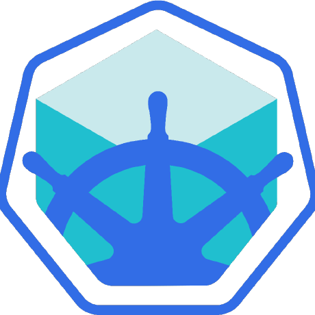

# Knative ml service

Simple project that aims to train skills regarding kubernetes and microservices architecture with the use of [Knative](https://knative.dev/docs/)

## Prerequisites
* Installed docker with version 20.10.18
* Minikube installed with version 1.28.0
* Knative installed and deployed ([Installation Guide](https://knative.dev/docs/install/)) (use Kourier as a load balancer)
* Ubuntu 22.04 (for Windows users there might be some tweaking regarding having WSL installed to use docker runtime for minikube)

## Dataset
To train models (which are XGBoost and SVM) I used kaggle dataset that can be found under the [link](https://www.kaggle.com/datasets/yasserh/housing-prices-dataset)

## How to run
To create whole deployment I use Makefile so only thing that is needed to run is to type `make` in main project dir. \
NOTE: To run deployment you have to first have trained models on dataset managed in dataset section and have them stored on s3 bucket configured in `configmap` (see [configmap](minikube/configmap/project_config.yaml))

## Tech stack
* Kubernetes </img>
* Knative </img>
* Minikube </img>
* Docker </img>
* FastAPI </img>
* Minio </img>

## Further improvements
Given the fact that this project aimed to be a PoC sample project I don't have any plan for further improvements.